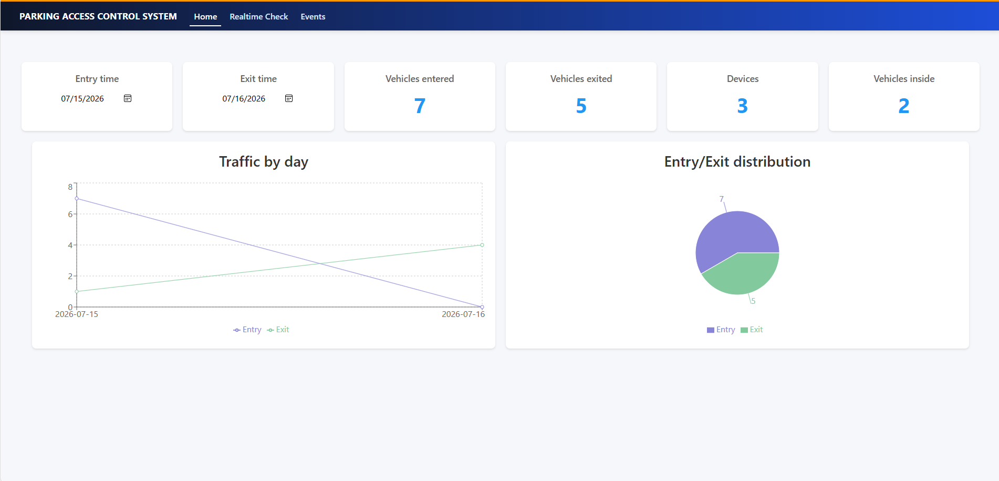
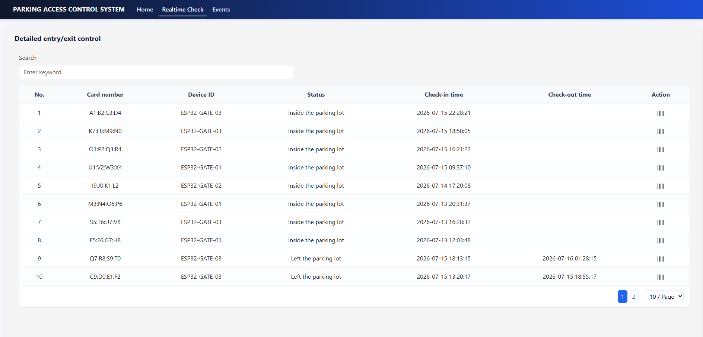
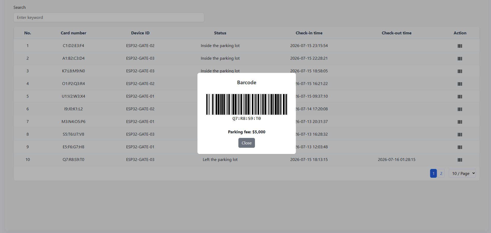
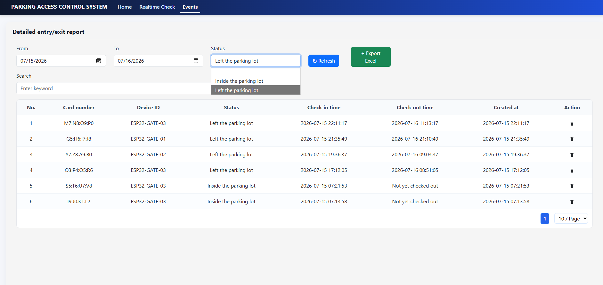

# ESP32 RFID Parking System

This project is an RFID-based parking access control system built with an ESP32 board, an RC522 RFID reader, a Node.js backend, MQTT, Socket.IO, MongoDB, and a React web dashboard. When an RFID card is scanned, the ESP32 reads the tag ID and sends it to the backend through MQTT. The server stores the event in MongoDB and broadcasts it to the web interface in real time.

# UI
### Home Page

### Realtime Check Page

### Bar code

### Events page

## Features
- RFID-based check-in and check-out events
- Real-time updates through MQTT and Socket.IO
- MongoDB persistence for access history
- Web dashboard for monitoring and management

## Hardware Requirements
- ESP32 development board
- RC522 RFID module
- Jumper wires
- USB cable and power supply

## Hardware Setup
1. Connect the RFID module to the ESP32 according to the wiring guide in the file ESP32_RC522/Chân kết nối.txt.
2. Upload the Arduino sketch from ESP32_RC522/ESP32_RC522.ino to the ESP32 board.

## Software Requirements
- Node.js (recommended: v18 or newer)
- MongoDB running locally or on a remote server
- A working MQTT broker (the project uses a public HiveMQ broker by default)

## Backend Setup
1. Open the backend folder:
   - cd Server/be
2. Install dependencies:
   - npm install
3. Review the environment file and update values if needed:
   - Server/be/.env
4. Start the backend server:
   - node server.js

The backend will run on the port defined in the environment file, which is currently set to 8999 by default.

## Frontend Setup
1. Open the frontend folder:
   - cd Server/fe
2. Install dependencies:
   - npm install
3. Start the development server:
   - npm start

The React app will open in your browser at http://localhost:3000.

## How to Use
1. Power on the ESP32 and make sure the sketch is uploaded successfully.
2. Start the MongoDB service and the backend server.
3. Open the web dashboard in the browser.
4. Scan an RFID card with the reader.
5. The system will record the event and display it in real time on the dashboard.

## Project Structure
- ESP32_RC522: Arduino source code and wiring notes
- Server/be: Node.js backend, API routes, MQTT, MongoDB, and Socket.IO integration
- Server/fe: React frontend interface
- Server_Run: built assets for deployment

## Notes
- The default MQTT host is configured in Server/be/.env. For production use, it is recommended to replace the public broker with your own secure broker.
- If the server fails to start, make sure MongoDB is running and the database host and name in the environment file are correct.

If you have any questions or need support, please contact:
- Email: huyle.bkict@gmail.com
- LinkedIn: https://www.linkedin.com/in/hoang-huy-le-35603b342
